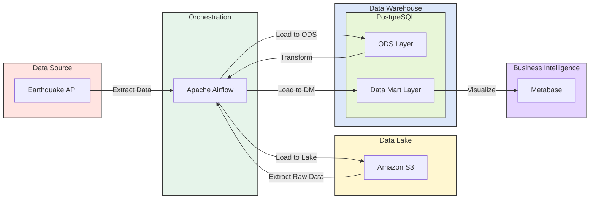

# Earthquake Data Pipeline Project

A mini Lakehouse-style data pipeline for ingesting, processing, and analyzing earthquake data using Airflow, S3, PostgreSQL, DuckDB and Metabase.

---

## Create Virtual Environment

```bash
python3.12 -m venv venv && \
source venv/bin/activate && \
pip install --upgrade pip && \
pip install -r requirements.txt
```

---

## Infrastructure Deployment

```bash
docker-compose up -d
```

---

## 1. Data Architecture

Lakehouse Architecture

This project follows a **Lakehouse Architecture**, combining a Data Lake for raw storage (S3) and a Data Warehouse (PostgreSQL) for analytics and BI.  
The diagram below illustrates the main data flow and processing layers.



---

## 2. Data Modeling & Design

Star, snowflake, or other dimensional models are not used because the dataset is small and static.  
The system state does not change, so the "AS IS" model type is used.

---

## 3. Data Storage & Operations

### Storage
- Cold / Warm Storage: S3  
- Hot Storage: PostgreSQL

### Compute / Operations
- DuckDB: Data Lake layer  
- PostgreSQL: Data Mart layer

---

## 4. Data Security

Security is implemented through:
- User-level access in S3
- Role-based access control in PostgreSQL
- Role management within Airflow

LDAP integration can also be configured.

---

## 5. Data Integration & Interoperability

This part is not implemented because it is unnecessary for demonstration purposes.  
However, for production systems, the ODS layer should be aligned to proper data types.

Example:

```sql
-- current
time varchar
```

Should be:

```sql
-- correct
time timestamp
```


---

## 6. Reference & Master Data

Data stored in the S3 Data Lake is considered "golden".  
It is ingested "as is" from the source, ensuring no data loss in the pipeline.  
Data modification is allowed only in the DWH or downstream layers.

---

## 7. Data Warehousing & Business Intelligence

Hot storage: PostgreSQL  
BI tool: Metabase

### Recommendations

1. Define a lifecycle for data marts to remove unused ones.
2. Define roles and access zones (C-level vs. operational users).
3. Follow data mart creation rules:
    - One metric → one mart
    - One metric → one view or materialized view
    - Use wide marts
    - Prefer unified tables structured as: date, metric_type, value
4. Monitor user activity and system load.
5. Automate updates to eliminate manual work.

---

## 8. Meta-data

Currently, there is no metadata, but it can be added via column comments in DWH.

Field descriptions: [USGS API Field Reference](https://earthquake.usgs.gov/data/comcat/index.php)

At the Data Lake level, consider using metadata cataloging tools such as:
- OpenMetaData
- DataHub

---

## 9. Data Quality

Data Quality is not yet implemented. This will be addressed in a future iteration.

### Key principles:

1. Ensure data successfully arrived (ACID checks).
2. Track SLA for data delivery.
3. Add alerts on critical dashboards.
4. Compare source vs DWH record counts (e.g., 1000 vs 999 rows).
5. Implement data correction mechanisms.
6. Test important dashboards before production—monitor deltas, averages, and thresholds.

---

## Notes

### SQL Schemas

```sql
CREATE SCHEMA ods;
CREATE SCHEMA dm;
CREATE SCHEMA stg;
```

### DDL: ods.fct_earthquake

```sql
CREATE TABLE ods.fct_earthquake
(
    time varchar,
    latitude varchar,
    longitude varchar,
    depth varchar,
    mag varchar,
    mag_type varchar,
    nst varchar,
    gap varchar,
    dmin varchar,
    rms varchar,
    net varchar,
    id varchar,
    updated varchar,
    place varchar,
    type varchar,
    horizontal_error varchar,
    depth_error varchar,
    mag_error varchar,
    mag_nst varchar,
    status varchar,
    location_source varchar,
    mag_source varchar
);
```

### DDL: dm.fct_count_day_earthquake

```sql
CREATE TABLE dm.fct_count_day_earthquake AS 
SELECT 
    time::date AS date, 
    COUNT(*)
FROM ods.fct_earthquake
GROUP BY 1;
```

### DDL: dm.fct_avg_day_earthquake

```sql
CREATE TABLE dm.fct_avg_day_earthquake AS
SELECT 
    time::date AS date, 
    AVG(mag::float)
FROM ods.fct_earthquake
GROUP BY 1;
```

---

## 10. Documentation
Full project documentation (architecture, setup, and data flow) is currently being prepared.  
Please check back later for detailed usage and design notes.
